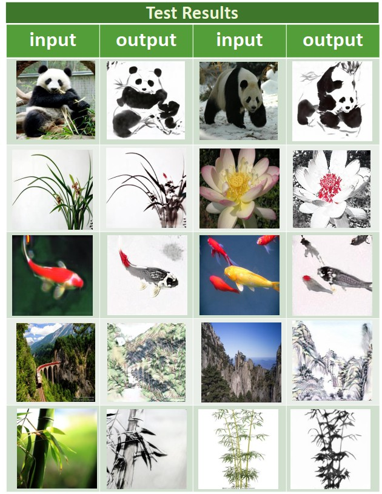
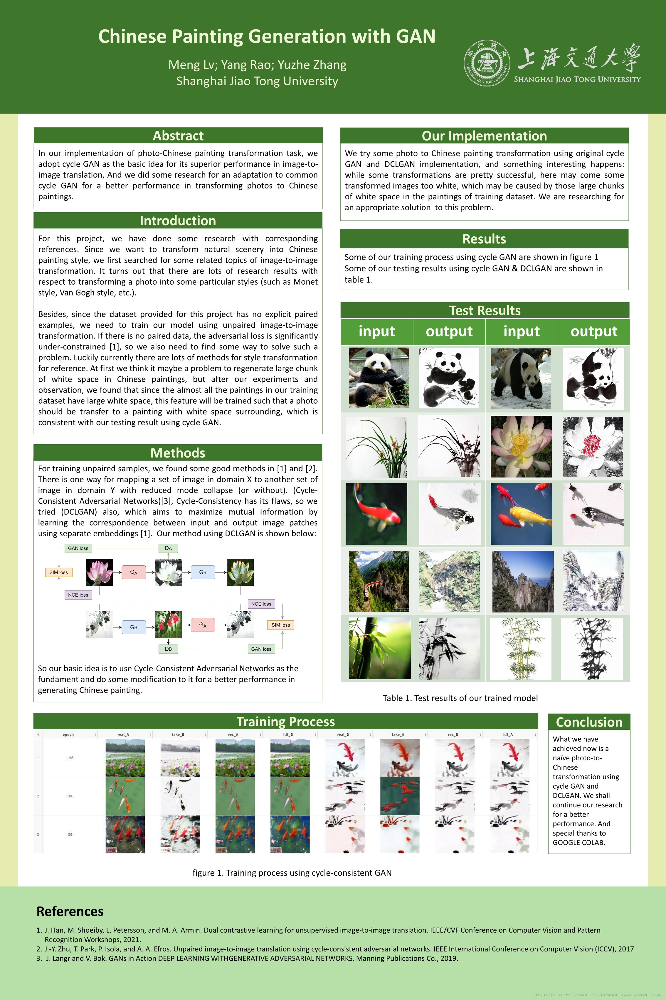

# Chinese Paiting Generation with Cycle GAN
In our implementation of photo-Chinese painting transformation task, we
adopt cycle GAN as the basic idea for its superior performance in image-to-image translation, And we did some research for an adaptation to common
cycle GAN for a better performance in transforming photos to Chinese
paintings.

What’s more, we adopt SSIM method and adjust details for specific types of images so that the converted results perform
better in Chinese paintings’ unique details like brushstrokes and lar
## Final Result Display

## Academic poster
### If you want to know more about the details of our implementation, you will
obtain sufficient information in our academic poster.
